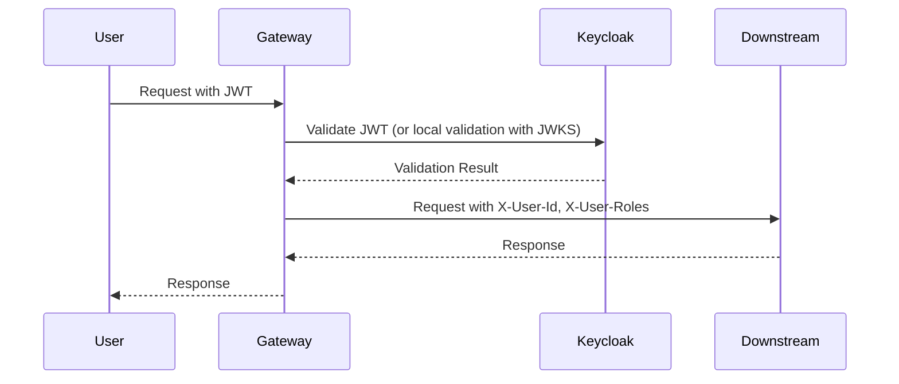

## Context

The platform currently lacks an authentication mechanism. To build a secure, multi-role (Student, Teacher, Admin) platform, we need a centralized SSO solution. Keycloak will act as the identity provider, and the Java Gateway will serve as the centralized authentication point to secure all downstream microservices.

## Goals / Non-Goals

**Goals:**
- Implement Keycloak as the centralized IdP.
- Implement JWT validation at the Java Gateway.
- Propagate user identity (userId, roles) to downstream microservices via HTTP headers (X-User-Id, X-User-Roles).

**Non-Goals:**
- Implementing fine-grained RBAC logic within downstream services at this stage. (Only authentication and header propagation is required).

## Decisions

### 1. Centralized vs. Decentralized Authentication
- **Decision**: Centralized Authentication at Gateway.
- **Rationale**: Simplifies downstream microservices, provides a single point for security enforcement, and is easier to manage across multi-language microservices (Java/Node.js).

### 2. Identity Propagation
- **Decision**: Use HTTP Headers (`X-User-Id`, `X-User-Roles`).
- **Rationale**: Efficient, easy to implement, and compatible with both Java and Node.js.

## Risks / Trade-offs

- [Risk] **Gateway Latency**: Centralized validation adds latency per request. 
  → Mitigation: Use local JWKS caching at the Gateway.
- [Risk] **Header Spoofing**: If an attacker bypasses the Gateway, they could spoof headers.
  → Mitigation: Ensure Gateway is the ONLY entry point to the internal network. Secure communication between Gateway and downstream services via network policies.

## Implementation Details

### Sequence Diagram

### K8s and CI/CD Implications
- **K8s**: Keycloak requires persistent storage and ConfigMap for realm configuration. 
- **CI/CD**: New secrets management (Keycloak admin password, DB password) via CI/CD pipelines/env vars.

### Observability and E2E
- **Observability**: Add trace ID to Gateway and propagate it to downstream services. Monitor 401/403 response rates at Gateway.
- **E2E**: Use Playwright to verify user flow: Login -> Access protected resource -> Verify identity passed to downstream.
